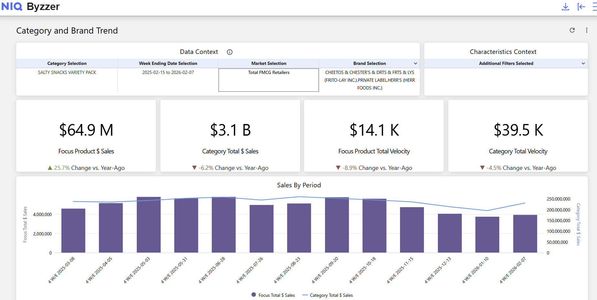
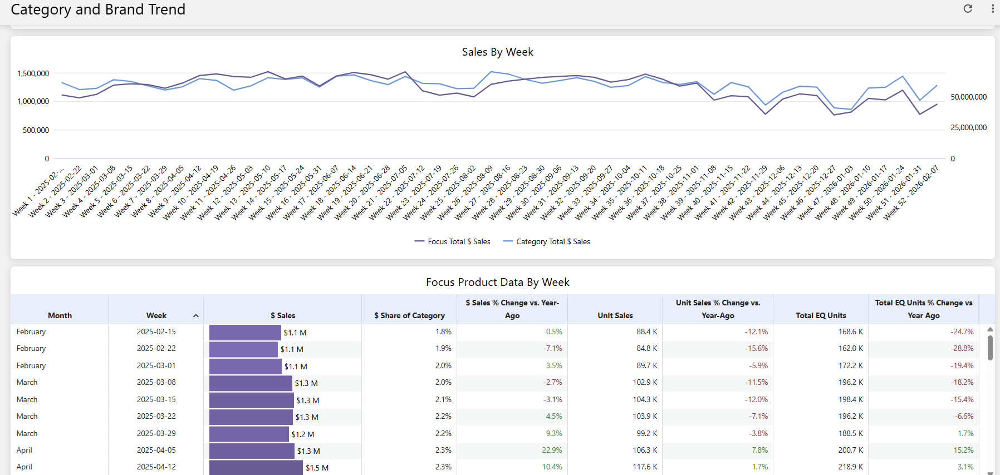
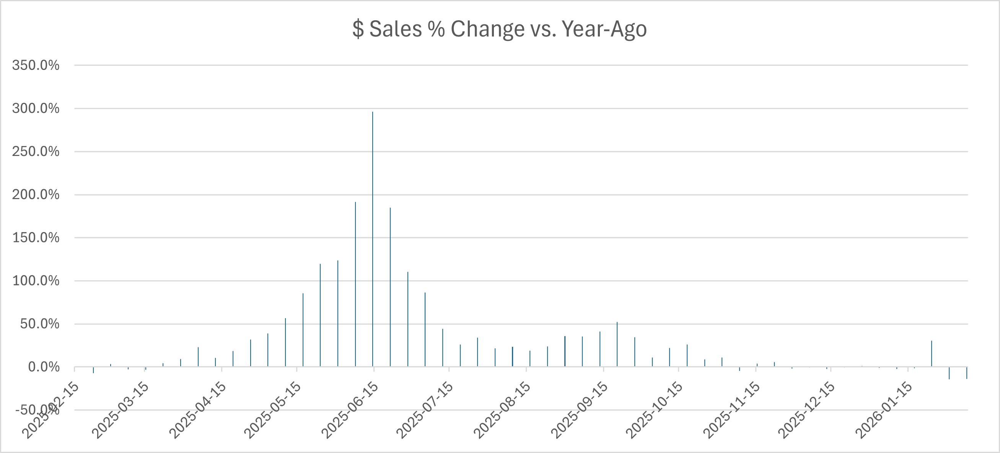
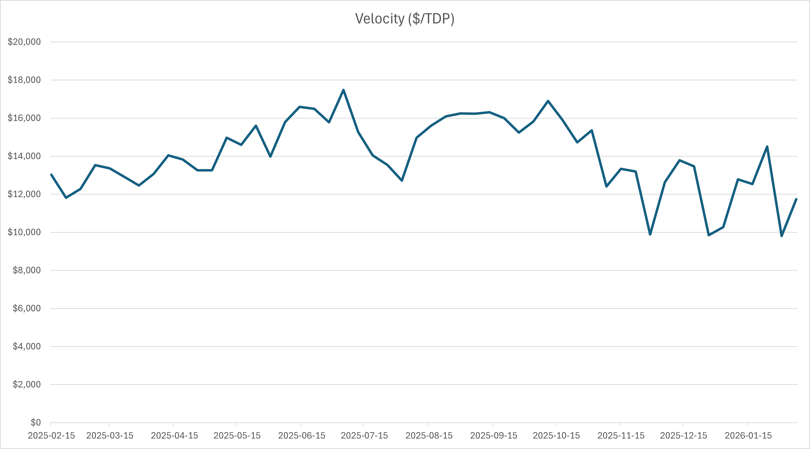
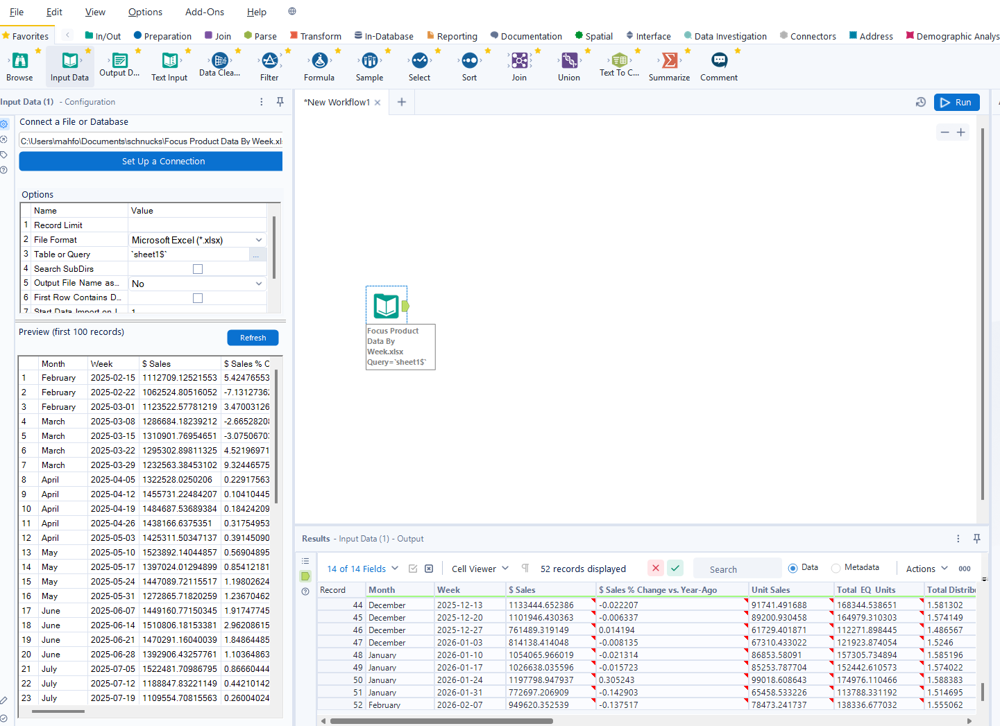
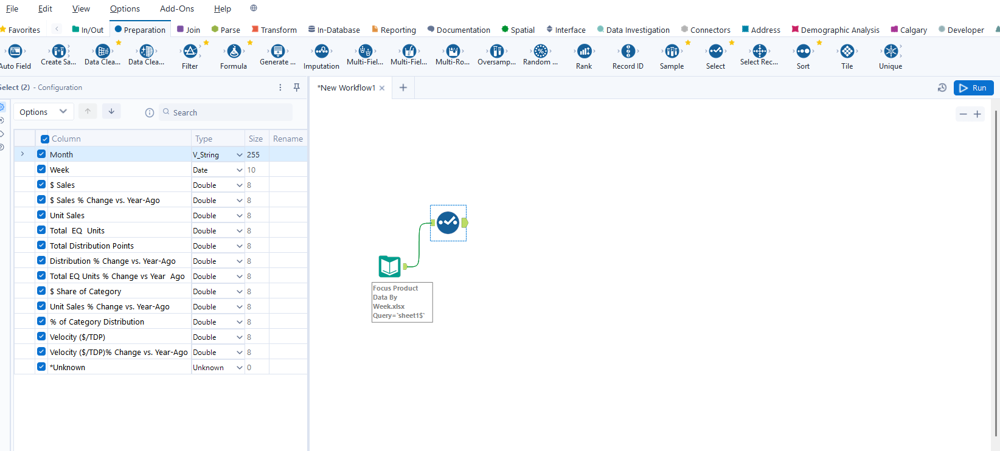
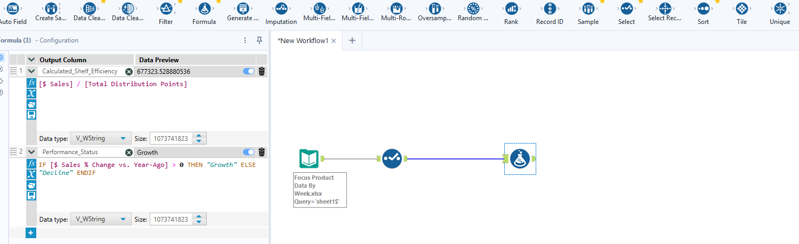
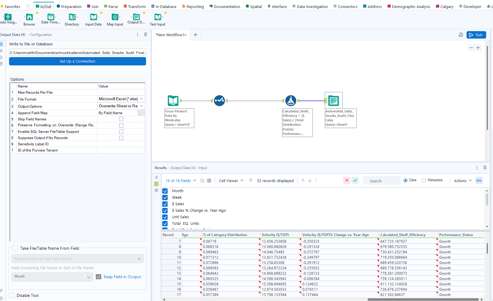

# End-to-End Retail Strategy: Salty Snacks Variety Pack Optimization

## Executive Summary
This project identifies a **+25.7% growth trend** in the Salty Snacks Variety Pack portfolio against a total category decline of **-6.2%**. The project consists of two distinct phases: 
1. **Quantitative Business Audit**: Strategic discovery of seasonal peaks and efficiency loss.
2. **Automated ETL Pipeline**: Engineering a scalable Alteryx workflow to modularize weekly reporting.

---

## Part 1: Business Audit & Insight Discovery (Excel/NIQ Byzzer)
Leveraging my background in **Mathematics and Statistics**, I modeled 52 weeks of longitudinal data ending February 7, 2026, to identify shelf-space productivity shifts.

### Key Performance Indicators (KPIs)
* **Total Category Sales**: $3.1 Billion total market.
* **Focus Product Sales**: $64.9 Million portfolio (Frito-Lay, Private Label, Herr’s).
* **Velocity ($/TDP)**: Measure of revenue generated per point of distribution.

### Platform Validation
Data was extracted and validated using the **NIQ Byzzer** retail analytics platform.

### Visual Analysis (Excel)
The analysis identified a massive **+296.2% growth peak** in mid-June and a **44% seasonal decline** in shelf productivity by January.

---

## Part 2: Data Engineering & Automation (Alteryx)
To scale this audit for weekly performance tracking, I developed a modular **ETL (Extract, Transform, Load)** pipeline in **Alteryx Designer** to automate manual data preparation.

### Engineering Workflow
* **Automated Ingestion**: Configured a dynamic input layer to process raw Excel exports, handling multi-line headers and string whitespace.
* **Type-Casting Schema**: Implemented a transformation layer to convert string-based currency data into **Double-precision** numbers for computational accuracy.
* **Calculated Metrics**: Engineered an automated "Shelf Efficiency" logic layer and conditional performance status categories.

---

## Strategic Recommendations
* **Dynamic Shelf Allocation**: Reallocate 10-15% of variety pack shelf space during January troughs to higher-velocity categories (e.g., wellness/New Year snacks).
* **Promotional Synchronization**: Align high-volume trade spend with the identified mid-June peak to capitalize on maximum consumer demand.
* **Automated Reporting**: Deploy the Alteryx ETL pipeline to reduce manual data preparation time by an estimated **95%**.

**Technical Skills Demonstrated**: Alteryx Designer | NIQ Byzzer | Excel Analytics | Data Engineering | Trend Modeling | Statistical Analysis
