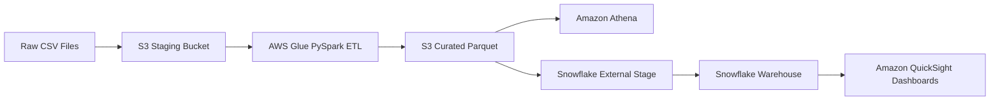

# Food Access & Public Health Correlation

## End-to-End Data Engineering Pipeline for Analyzing Food Deserts, Poverty, and Obesity Risk

---

## Project Summary

This project implements a production-style **data engineering pipeline** to quantify how socioeconomic conditions and food accessibility correlate with obesity outcomes across U.S. counties.

Public datasets from the USDA Food Access Research Atlas and County Health Rankings are ingested into an Amazon S3 data lake, transformed using AWS Glue (PySpark), optimized into Parquet, loaded into Snowflake for analytics, and visualized in Amazon QuickSight.

The goal is to demonstrate practical data engineering patterns:
* Data lake architecture (raw → curated)
* Serverless ETL
* Columnar storage optimization
* External warehouse ingestion
* SQL analytics
* BI consumption layer
* Secure IAM governance

---

## Key Findings

* **37M+ Americans** live in low-access food areas.
* **1,200+ counties** classified as food deserts.
* Poverty strongly correlates with obesity.
* Food desert status adds additional independent health risk.
* High-intensity clusters observed in Mississippi and Alabama.

These patterns indicate structural food access as a distinct public health factor beyond income alone.

Dashboard output is available in:
`docs/docs/U.S. Public Health Equity- The Food Access & Obesity Correlation  .pdf`

---

## Architecture



---

## Technology Stack

### Storage

* **Amazon S3**: Staging (`mb-food-access-staging3`) and Curated (`mb-food-access-warehouse`) zones.

### Processing

* **AWS Glue**: Serverless ETL compute.
* **PySpark**: Data transformation engine.

### Formats

* **CSV**: Raw source data.
* **Parquet**: Curated columnar storage with Snappy compression.

### Query & Analytics

* **Amazon Athena**: Serverless SQL exploration.
* **Snowflake**: Enterprise cloud data warehouse.

### Visualization

* **Amazon QuickSight**: BI dashboarding.

### Governance

* **AWS IAM**: Least-privilege roles and policies.

---

## Data Pipeline Design

### 1. Raw Zone (S3 Staging)

* Raw CSV datasets uploaded to `mb-food-access-staging3`.
* Immutable source of truth for reproducibility and lineage.

---

### 2. ETL Layer (AWS Glue)

The Glue PySpark job performs schema normalization, dataset joins on FIPS codes, and type casting.

```python
# Join CHR and FARA datasets
Join_node = Join.apply(frame1=CHR_node, frame2=FARA_node, keys1=["fipscode"], keys2=["fips"])

# Drop redundant fields and Change Schema
DropFields_node = DropFields.apply(frame=Join_node, paths=["fips", ".County", ".State"])

# Write to S3 Curated Zone in Parquet Format
Destination_node = glueContext.write_dynamic_frame.from_options(
    frame=DropFields_node, 
    connection_type="s3", 
    format="glueparquet", 
    connection_options={"path": "s3://mb-food-access-warehouse/"}
)

```

Visual flow available in: `glue_scripts/AWS Glue ETL Job.jpg`

---

### 3. Curated Zone (Parquet)

* Optimized columnar storage for faster scans and lower costs.
* Cataloged in the **Glue Data Catalog** for analytics readiness.

---

### 4. Analytics Layer

#### Athena

Used for exploratory SQL and schema validation.


```sql
-- 1. Verify table structure
DESCRIBE mb_food_access_warehouse;

-- 2. Sample data with all columns
SELECT * FROM mb_food_access_warehouse LIMIT 10;

```
Visual flow available in: `athena_queries/Amazon Athena Queries4.png**`:
#### Snowflake

Used as the enterprise warehouse for advanced modeling.


```sql
CREATE OR REPLACE STAGE food_access_warehouse_stage 
URL = 's3://mb-food-access-warehouse/' 
CREDENTIALS = (AWS_KEY_ID = 'REDACTED' AWS_SECRET_KEY = 'REDACTED');

```

**Modeling from `snowflake_sql/Final Snowflake Integration.png**`:

```sql
-- Create physical table and audit views
CREATE OR REPLACE TABLE FOOD_ACCESS_FULL_DATASET ( ... );

-- Zero-copy cloning for testing
CREATE TABLE FOOD_ACCESS_DEV CLONE FOOD_ACCESS_FULL_DATASET;

**Stage Setup from `snowflake_sql/Successful Snowflake Stage Listing.png**`:

```

---

### 5. Visualization Layer

Amazon QuickSight connects to Snowflake to provide geospatial maps and correlation plots.

**Visual Proofs**:

* `docs/docs/U.S. Public Health Equity- The Food Access & Obesity Correlation  .pdf`
* `snowflake_sql/Snowflake Data Cloning.png`

---

## Repository Structure

```
docs/              # ArchitectureDiagram.pdf, docs/U.S. Public Health Equity- The Food Access & Obesity Correlation  .pdf
glue_scripts/      # AWS Glue ETL Job Script.jpg, AWS Glue ETL Job.jpg
athena_queries/    # Amazon Athena Queries4.png
snowflake_sql/     # Successful Snowflake Stage Listing.png, Final Snowflake Integration.png
README.md

```

---

## Setup Overview

1. Create S3 staging and warehouse buckets.
2. Configure **IAM roles** for Glue and Snowflake access.
3. Deploy **Glue ETL job** to generate Parquet outputs.
4. Create **Snowflake external stage** and load data.
5. Connect **QuickSight** to Snowflake.

---

## Why This Is a Data Engineering Project

This system demonstrates:

* **Data lake design** (Raw → Curated).
* **ETL development** with PySpark.
* **Storage optimization** via Parquet.
* **Warehouse modeling** and zero-copy cloning.
* **Secure access control** with IAM.

---

## Author

**Mahfoud Bouad**
